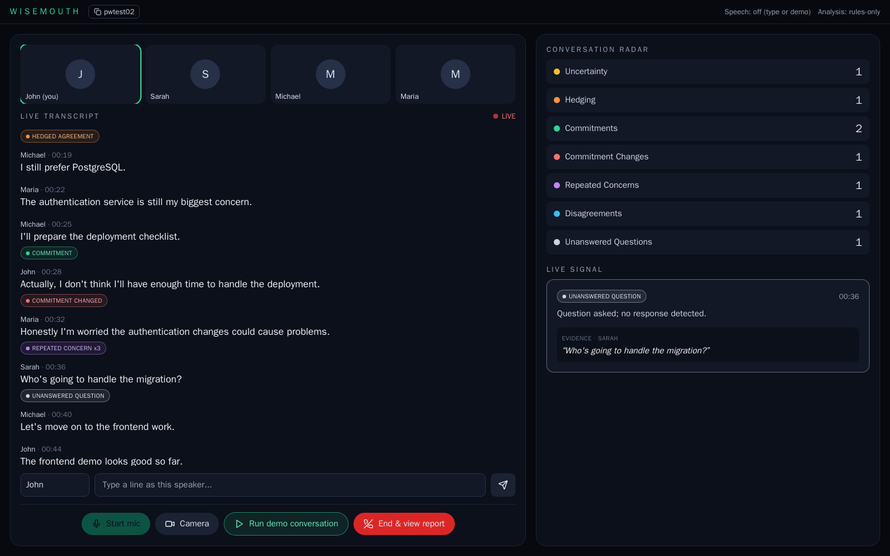

# WiseMouth

**See what the conversation doesn't explicitly say.**

WiseMouth is a real-time conversation intelligence layer. It listens to a conversation (AssemblyAI streaming speech-to-text), and surfaces *observable* language signals with evidence: uncertainty, hedged agreement, commitments, **changed commitments**, repeated concerns, unresolved disagreements and unanswered questions. It never claims to read emotions, detect lies or know intent.

> AssemblyAI hears it. Rules detect it. The LLM understands it. Conversation state connects it. WiseMouth makes it visible.



## Quick start

```bash
cp .env.example .env     # optional keys: ASSEMBLYAI_API_KEY (mic), GROQ_API_KEY / GEMINI_API_KEY (LLM)
docker compose up --build
```

Open http://localhost:3000 -> **Start Conversation** -> **Run demo conversation** -> **End & view report**.
No keys are needed for typed input and the demo (rules-only analysis); add an AssemblyAI key to use the microphone.

## Stack

Next.js + TypeScript + Tailwind + Recharts | FastAPI + WebSockets + Pydantic + SQLAlchemy | PostgreSQL (SQLite fallback) | AssemblyAI streaming STT | Groq -> Gemini LLM (optional)

## Repository

```
backend/    FastAPI app, signal engine, tests      (backend/app/services = the engine)
frontend/   Next.js app                            (components, hooks, lib)
docs/       Full documentation - start at docs/README.md
scripts/    smoke.py end-to-end check
docker-compose.yml  .env.example
```

## Documentation

Everything lives in [docs/](docs/README.md): product overview, architecture, setup, signal catalog, API/events, frontend guide, demo runbook, testing, deployment, decisions and troubleshooting, status and roadmap.

## Status

Backend tests: 31 passing. End-to-end demo verified (smoke script and browser) against the Docker stack with Postgres. Still to verify with real credentials: live microphone via AssemblyAI and the Groq/Gemini refinement path. See [docs/11-status-and-roadmap.md](docs/11-status-and-roadmap.md).
